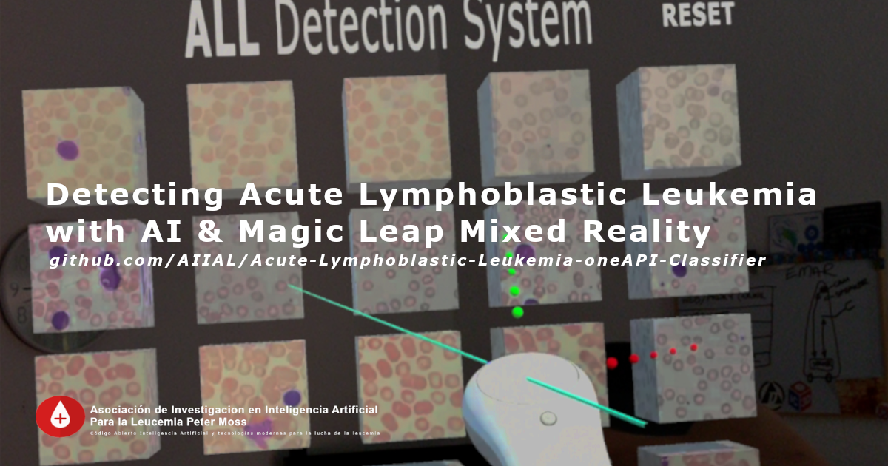
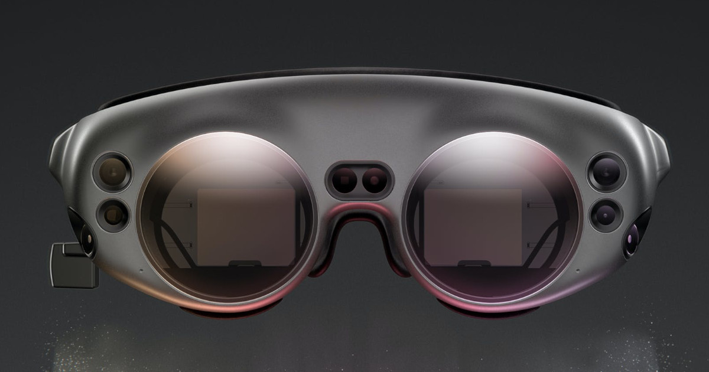

# Asociación de Investigacion en Inteligencia Artificial Para la Leucemia Peter Moss
## Magic Leap 1 Acute Lymphoblastic Leukemia Detection System

      

&nbsp;

# Table Of Contents

- [Abstract](#abstract)
- [DISCLAIMER](#disclaimer)
- [Introduction](#introduction)
  - [Acute Lymphoblastic Leukemia](#acute-lymphoblastic-leukemia)
  - [Dataset](#dataset)
    - [ALL_IDB1](#all_idb1)
  - [Model](#model)
  - [Raspberry Pi 4](#raspberry-pi-4)
  - [HIAS](#hias)
- [About Magic Leap 1](#about-magic-leap-1)
- [About Unity 3D](#about-unity-3d)
- [Get Started](#get-started)
- [Contributing](#contributing)
  - [Contributors](#contributors)
- [Versioning](#versioning)
- [License](#license)
- [Bugs/Issues](#bugs-issues)

&nbsp;

# Abstract

The Magic Leap Acute Lymphoblastic Leukemia (ALL) Detection System 2020 uses the Magic Leap 1 headset to display microscopic images of blood samples containing ALL positive and negative samples in Mixed Reality. The project combines Mixed Reality with Artificial Intelligence to provide a real-time detection system capable of detecting ALL positive and negative samples.

&nbsp;

# DISCLAIMER

These projects should be used for research purposes only. The purpose of the projects are to show the potential of Spatial Computing, Artificial Intelligence, and the Internet of Things for medical support systems such as diagnosis systems.

Although the classifier used in this project is very accurate and shows good results both on paper and in real world testing, it is not meant to be an alternative to professional medical diagnosis.

Developers that have contributed to this repository have experience in using Artificial Intelligence for detecting certain types of cancer & COVID-19. They are not a doctors, medical or cancer/COVID-19 experts. Please use these systems responsibly.

&nbsp;

# Introduction

The Magic Leap Acute Lymphoblastic Leukemia (ALL) Detection System 2020 combines Mixed Reality with an Artificial Intelligence algorithm trained to detect Acute Lymphoblastic Leukemia in unseen images.

## Acute Lymphoblastic Leukemia

Acute Lymphoblastic Leukemia (ALL) is a cancer of the blood which attacks the white blood cells, or Lymphocytes, which play an important part in the immune system. With ALL, an abnormal number of immature Lymphocytes are produced meaning a reduction in healthy cells.

## Dataset
You need to be granted access to use the Acute Lymphoblastic Leukemia Image Database for Image Processing dataset. You can find the application form and information about getting access to the dataset on [this page](https://homes.di.unimi.it/scotti/all/#download) as well as information on how to contribute back to the project [here](https://homes.di.unimi.it/scotti/all/results.php). If you are not able to obtain a copy of the dataset please feel free to try this tutorial on your own dataset, we would be very happy to find additional AML & ALL datasets.

### ALL_IDB1

In this project, [ALL-IDB1](https://homes.di.unimi.it/scotti/all/#datasets) is used, one of the datsets from the Acute Lymphoblastic Leukemia Image Database for Image Processing dataset. We will use data augmentation to increase the amount of training and testing data we have.

"The ALL_IDB1 version 1.0 can be used both for testing segmentation capability of algorithms, as well as the classification systems and image preprocessing methods. This dataset is composed of 108 images collected during September, 2005. It contains about 39000 blood elements, where the lymphocytes has been labeled by expert oncologists. The images are taken with different magnifications of the microscope ranging from 300 to 500."

## Model

The project uses a Tensorflow classifier that was trained using Intel's OneAPI, and OpenVINO for running the model a Rasperry Pi 4.

This project uses the trained model from the [Acute Lymphoblastic Leukemia oneAPI Classifier](https://github.com/AIIAL/Acute-Lymphoblastic-Leukemia-oneAPI-Classifier "Acute Lymphoblastic Leukemia oneAPI Classifier"). The model was trained using Intel's OneAPI for optimization, and OpenVINO for running the model a Rasperry Pi 4.

The model was trained using positive and negative samples achieving 98% accuracy at detecting ALL in unseen images.

## Raspberry Pi 4

The classifier is homed on a Raspberry Pi 4 which hosts a local endpoint making the classifier accessible to the Magic Leap application. This feature allows near real-time classification of ALL in Mixed Reality over the local network.

## HIAS

The classifier is connected to the HIAS iotJumpWay MQTT broker, requests are authenticated using the HIAS private blockchain via the MQTT IoT Agent, and classifications are stored in the historical database along with a hash of the classification for data integrity. The IoT Agent stores contextual data of the classifier in the HIASCDI Context Broker.

&nbsp;

# About Magic Leap 1

This project uses the revolutionary Magic Leap 1 and Magic Leap's Spatial Computing Environment. Magic Leap 1 is a lightweight headset that uses Spatial Computing to map out rooms allowing applications to understand their enviroment and to interact accordingly.

To develop applications for Magic Leap 1 we use the [Magic Leap Lab](https://developer.magicleap.com/downloads "Magic Leap Lab") which allows us to use [Lumin SDK](https://developer.magicleap.com/en-us/learn/guides/lumin-sdk-latest-release-notes "Lumin SDK"), Lumin Runtime editor, and SDK packages for [Unity Software](https://unity.com/ "Unity Software") and [Unreal Editor](https://www.unrealengine.com/en-US/ "Unreal Editor").

**We would like to thank Magic Leap for sponsoring the Magic Leap 1!**

&nbsp;

# About Unity 3D

This project uses [Unity 3d](https://unity.com/ "Unity 3d"), a real-time 3D development platform. Combined with the [Lumin SDK](https://developer.magicleap.com/en-us/learn/guides/lumin-sdk-latest-release-notes "Lumin SDK"), Unity allows you to create breath taking, next generation projects for the Magic Leap Spatial Computing Environment.

&nbsp;

# Contributing

The Peter Moss Acute Myeloid & Lymphoblastic Leukemia AI Research Project encourages and welcomes code contributions, bug fixes and enhancements from the Github.

Please read the [CONTRIBUTING](CONTRIBUTING.md "CONTRIBUTING") document for a full guide to forking our repositories and submitting your pull requests. You will also find information about our code of conduct on this page.

## Contributors

- [Adam Milton-Barker](https://www.leukemiaresearchassociation.ai/team/adam-milton-barker "Adam Milton-Barker") - [Asociacion De Investigacion En Inteligencia Artificial Para La Leucemia Peter Moss](https://www.leukemiaresearchassociation.ai "Asociacion De Investigacion En Inteligencia Artificial Para La Leucemia Peter Moss") President & Lead Developer, Sabadell, Spain

&nbsp;

# Versioning

We use SemVer for versioning.

&nbsp;

# License

This project is licensed under the **MIT License** - see the [LICENSE](LICENSE.md "LICENSE") file for details.

&nbsp;

# Bugs/Issues

We use the [repo issues](issues "repo issues") to track bugs and general requests related to using this project. See [CONTRIBUTING](CONTRIBUTING.md "CONTRIBUTING") for more info on how to submit bugs, feature requests and proposals.