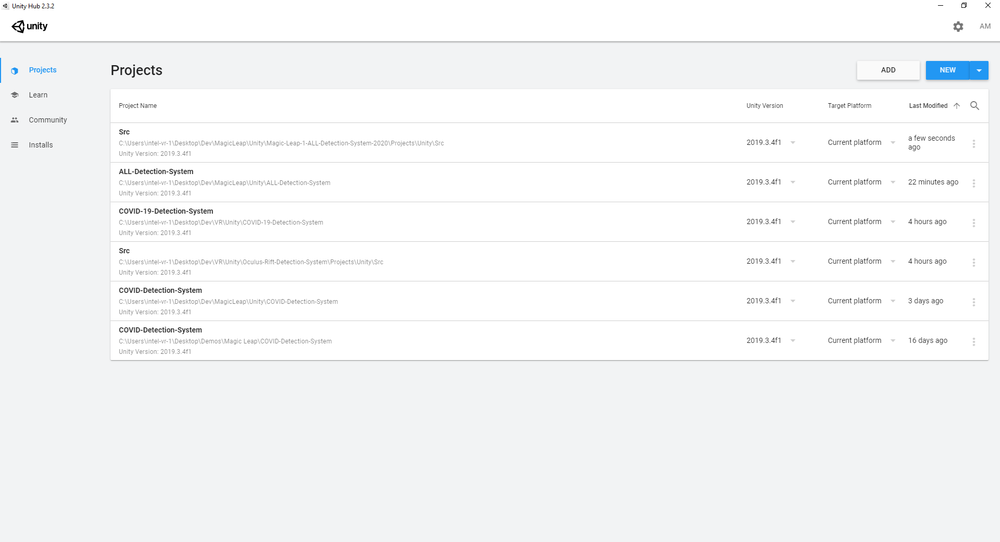
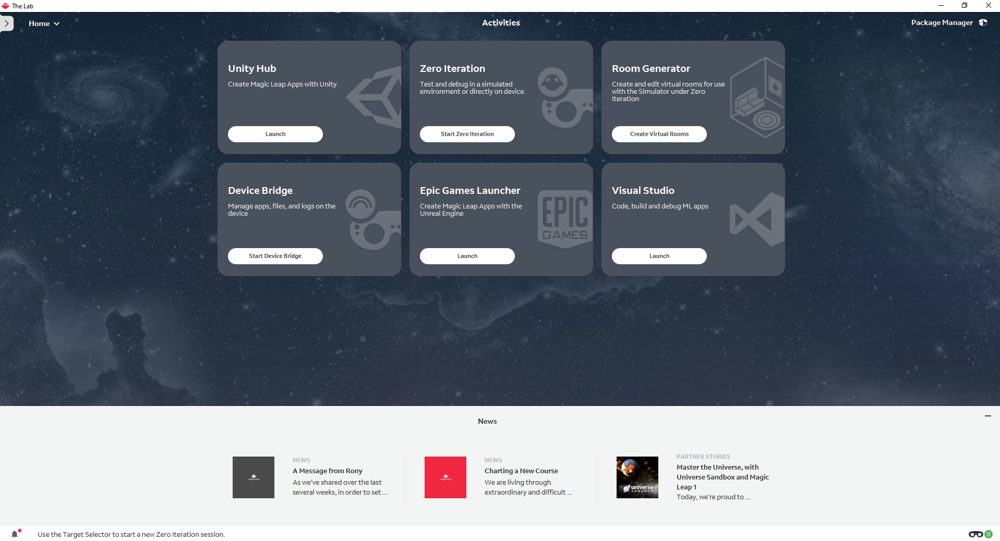
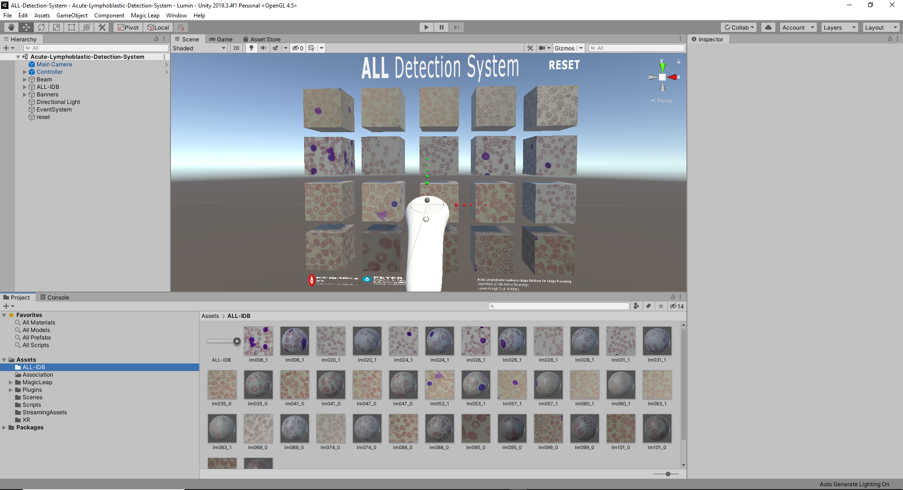
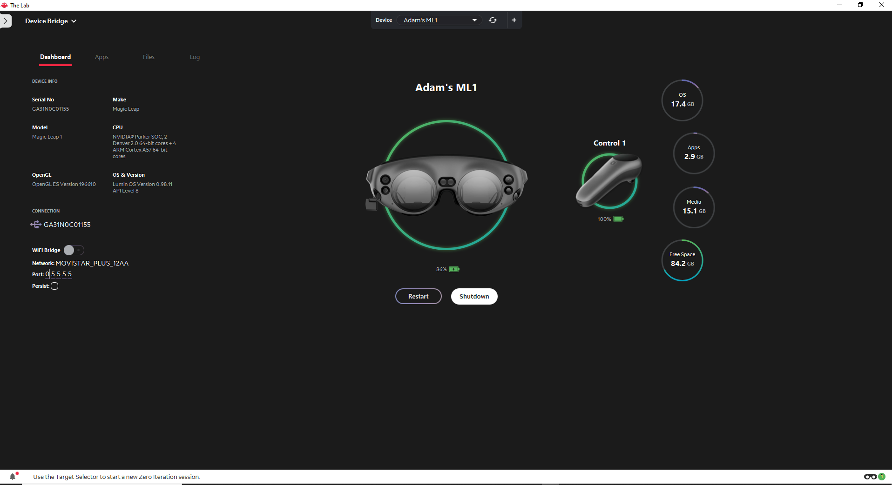
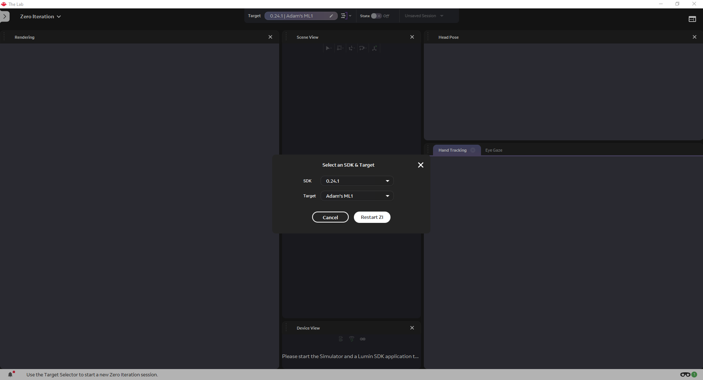
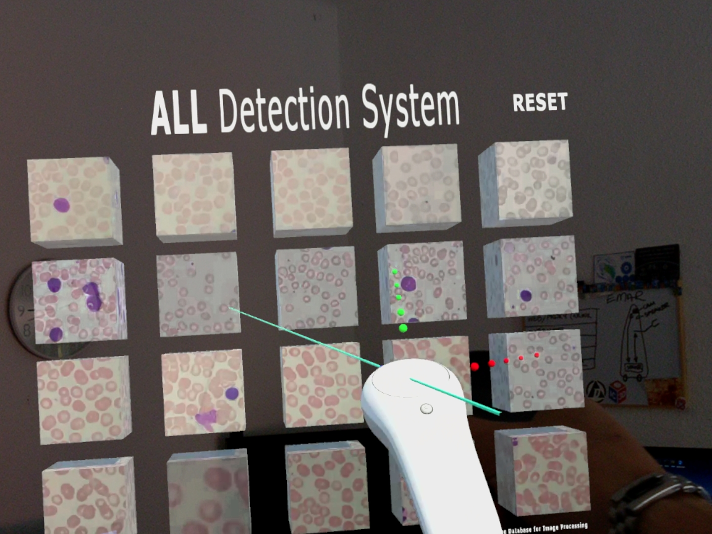
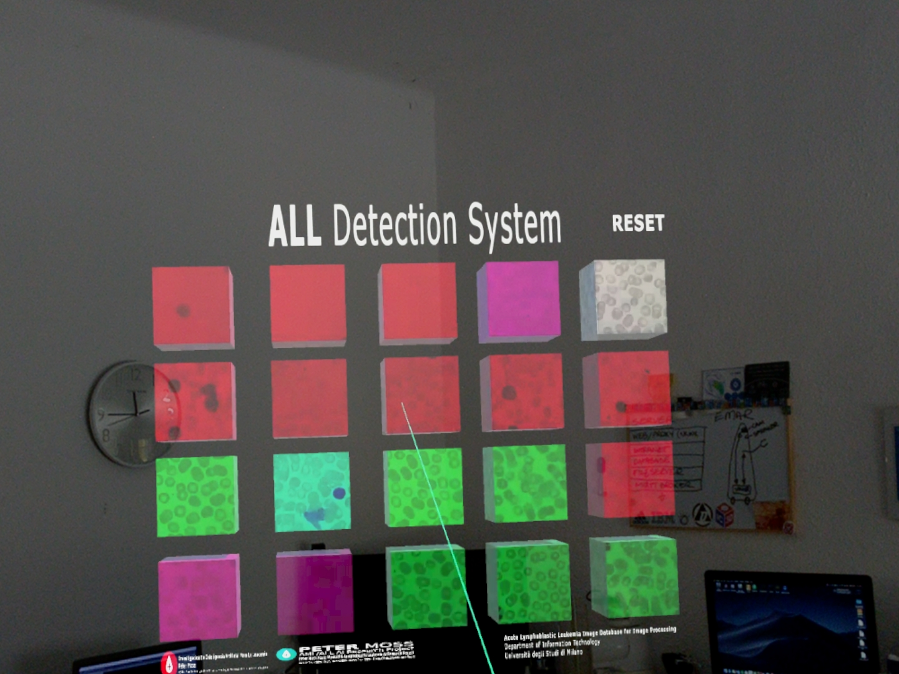
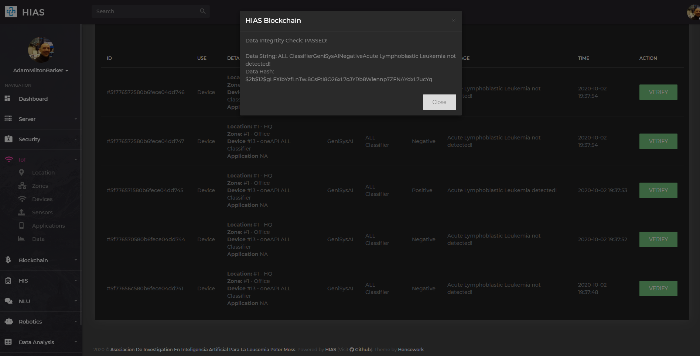
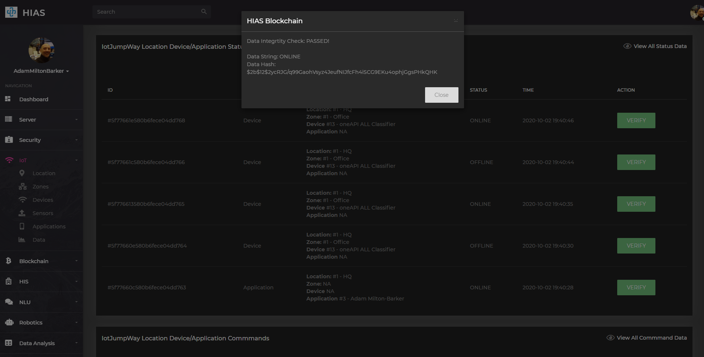

# Asociación de Investigacion en Inteligencia Artificial Para la Leucemia Peter Moss
## Magic Leap 1 Acute Lymphoblastic Leukemia Detection System

&nbsp;

# Table Of Contents

- [Introduction](#introduction)
- [DISCLAIMER](#disclaimer)
- [Installation](#installation)
- [Useage](#useage)
  - [Unity Hub](#unity-hub)
  - [Device Bridge](#device-bridge)
  - [Zero Iteration](#zero-iteration)
  - [Classification Server](#classification-server)
  - [Run The App](#run-the-app)
  - [Data](#data)
- [Contributing](#contributing)
  - [Contributors](#contributors)
- [Versioning](#versioning)
- [License](#license)
- [Bugs/Issues](#bugs-issues)

&nbsp;

# Introduction

This guide will guide you through the installation process for the Magic Leap 1 Acute Lymphoblastic Leukemia Detection System.

&nbsp;

# DISCLAIMER

This project should be used for research purposes only. The purpose of the project is to show the potential of Spatial Computing, Artificial Intelligence, and the Internet of Things for medical support systems such as diagnosis systems.

Although the classifier used in this project is very accurate and shows good results both on paper and in real world testing, it is not meant to be an alternative to professional medical diagnosis.

Developers that have contributed to this repository have experience in using Artificial Intelligence for detecting certain types of cancer & COVID-19. They are not a doctors, medical or cancer experts. Please use these systems responsibly.

&nbsp;

# Installation

Please follow the [Installation Guide](installation/windows-10.md) to install Magic Leap 1 Acute Lymphoblastic Leukemia Detection System.

&nbsp;

# Useage

After following the installation guide you should now have all of the required tools installed. Use the following guides to start using the **Magic Leap 1 Acute Lymphoblastic Leukemia Detection System**.

## Unity Hub

Open **Magic Leap's Lab** and click on the **Launch** button for **Unity Hub**.

Once you have done this you can open the project in Unity by clicking on it.

## Device Bridge

Now you need to setup your Magic Leap 1 device in [Device Bridge](https://developer.magicleap.com/en-us/learn/guides/magic-leap-device-bridge-reference "Device Bridge"). To do this first turn on your Magic Leap device and open your world. Make sure you are in the center of your room and facing the way you want your app to open.

Once turned on and inside your world, you need to attach your Magic Leap 1 to your computer using the USB type C  connector.

Now head to Device Bridge in Lab. You should see the above in Device Bridge.

Click on the **WiFi Bridge** button to activate WiFi, Device Bridge will reload and you should see the IP assigned to your device. This means that your PC is now bridged to the Magic Leap 1 device via WiFi.

## Zero Iteration

[Zero Iteration](https://developer.magicleap.com/en-us/learn/guides/lab-zi "Zero Iteration") allows you to run your apps directly on the Magic Leap 1 device. Providing you have followed the above steps, open Zero Iterator from the Lab homepage, select your device, and restart the program.

## Classification Server

Now you need to make sure that your **Acute Lymphoblastic Leukemia oneAPI Classifier** is running in **server_openvino** mode on your Raspberry Pi and waiting for requests.

## Run The App

Now you are ready to fire up the Magic Leap 1 Acute Lymphoblastic Leukemia Detection System!

Head over to Unity and click on the play button. You can remove the cable connection and move to the center of your room. You should now see the Magic Leap 1 Acute Lymphoblastic Leukemia Detection System in your view.

Now use your controller to hit the blocks by pointing the laser at the blocks. This will send the relevant image to the server for classification.

The server will return the response to the Magic Leap 1 and the color of the block will change.

- **RED** Specifies a true positive (ALL positive)
- **GREEN** Specifies a true negative (ALL negative)
- **Magento** Specifies a false positive (ALL negative but classifier determined ALL positive)
- **Cyan** Specifies a false negative (ALL positive but classifier determined ALL negative)

You can reset the application by hitting the **RESET** button with the laser.

## Data

A record of classifications are stored in the HIAS IoT Database via MQTT. Before the data can be stored in the database, the iotJumpWay service will verify via the HIAS iotJumpWay Blockchain Contract that the device has the permissions to store the data. Once the data is stored, a hash is stored on the blockchain which provides data integrity.

A record of each time the device connects and disconnects from the broker is also saved in the database, and a hash on the blockchain for data integrity.

&nbsp;

# Contributing

The Asociación de Investigacion en Inteligencia Artificial Para la Leucemia Peter Moss encourages and welcomes code contributions, bug fixes and enhancements from the Github community.

Please read the [CONTRIBUTING](../CONTRIBUTING.md "CONTRIBUTING") document for a full guide to forking our repositories and submitting your pull requests. You will also find information about our code of conduct on this page.

## Contributors
- [Adam Milton-Barker](https://www.leukemiaairesearch.com/association/volunteers/adam-milton-barker "Adam Milton-Barker") - [Asociación de Investigacion en Inteligencia Artificial Para la Leucemia Peter Moss](https://www.leukemiaresearchassociation.ai "Asociación de Investigacion en Inteligencia Artificial Para la Leucemia Peter Moss") President/Founder & Lead Developer, Sabadell, Spain

&nbsp;

# Versioning

We use SemVer for versioning. For the versions available, see [Releases](../releases "Releases").

&nbsp;

# License

This project is licensed under the **MIT License** - see the [LICENSE](../LICENSE "LICENSE") file for details.

&nbsp;

# Bugs/Issues

We use the [repo issues](../../issues "repo issues") to track bugs and general requests related to using this project. See [CONTRIBUTING](../CONTRIBUTING.md "CONTRIBUTING") for more info on how to submit bugs, feature requests and proposals.