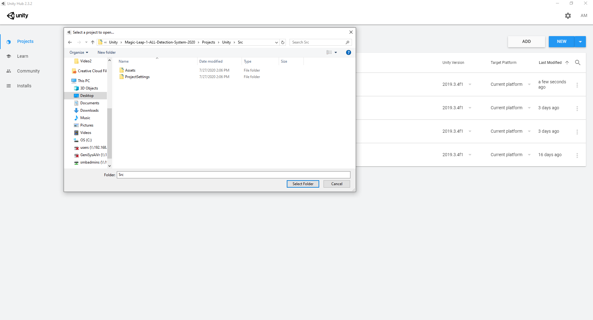
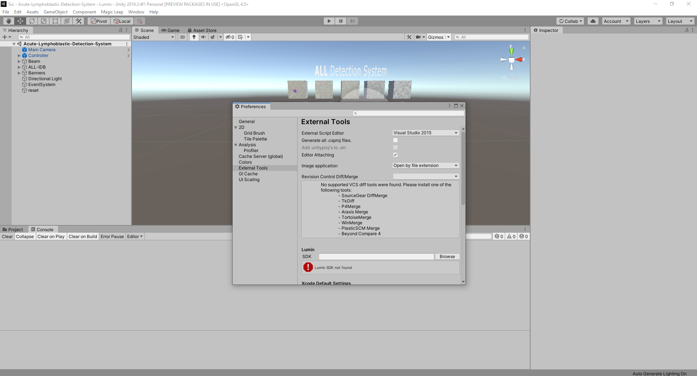
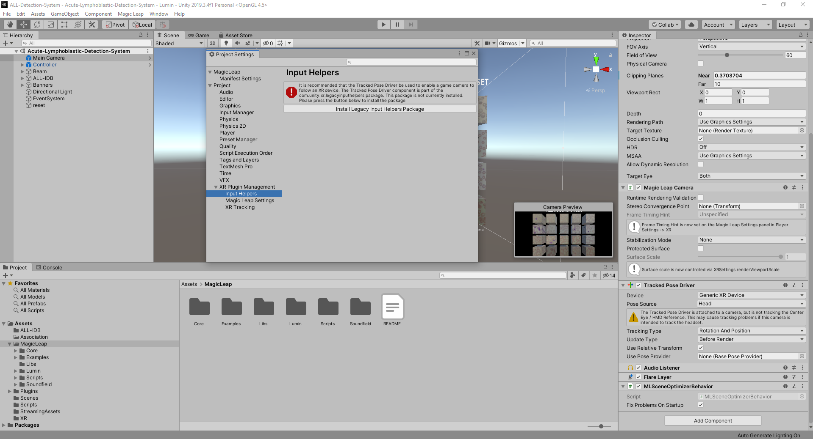
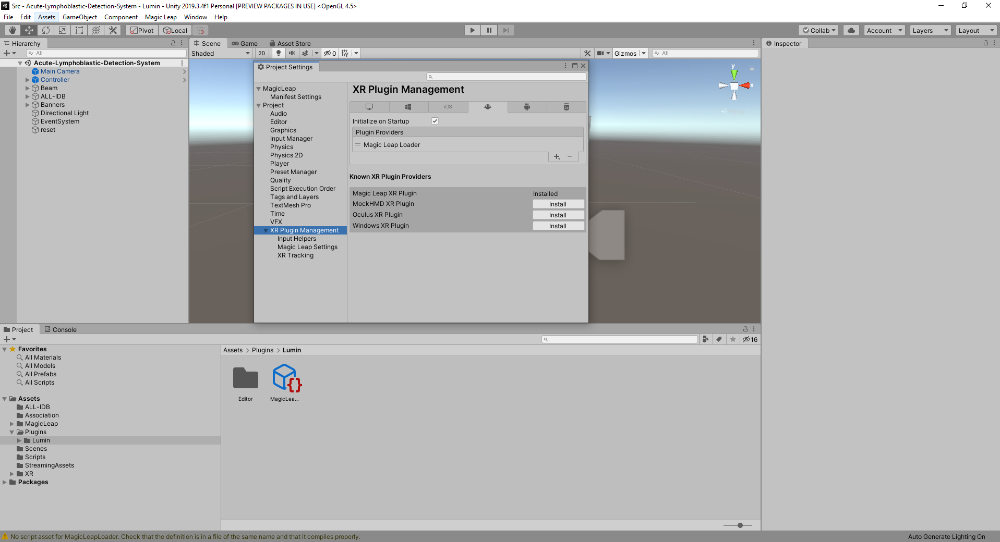

# Peter Moss COVID-19 AI Research Project
## Magic Leap 1 COVID-19 Detection System
### Unity

[](https://github.com/COVID-19-AI-Research-Project/Magic-Leap-1-Detection-System)

&nbsp;

# Table Of Contents

- [Introduction](#introduction)
- [Required Hardware](#required-hardware)
- [Prerequisites](#prerequisites)
  - [HIAS Server](#hias-server)
  - [ALL-IDB](#all-idb)
  - [Acute Lymphoblastic Leukemia oneAPI Classifier](#acute-lymphoblastic-leukemia-oneapi-classifier)
  - [Clone the repository](#clone-the-repository)
    - [Developer Forks](#developer-forks)
- [Installation](#installation)
    - [Magic Leap Basics](#magic-leap-basics)
    - [Unity 2019.3.4f1](#unity-201934f1)
    - [Magic Leap 1](#magic-leap-1)
- [Continue](#continue)
- [Contributing](#contributing)
  - [Contributors](#contributors)
- [Versioning](#versioning)
- [License](#license)
- [Bugs/Issues](#bugs-issues)

&nbsp;

# Introduction

The following guide will take you through setting up and installing the [ Magic Leap 1 COVID-19 Detection System](https://github.com/COVID-19-AI-Research-Project/Magic-Leap-1-Detection-System/Projects/Unity " Magic Leap 1 COVID-19 Detection System").

We would like to thank Rodney at Magical Light and Sound for personally taking his time to help us get off the ground with using the Unity development platform with Magic Leap. You can follow his tutorials on his [Github](https://github.com/magicallightandsound "Github") and [Twitch](https://www.twitch.tv/rodneydeveloper "Twitch").

&nbsp;

# Required Hardware

- [Magic Leap 1](https://www.magicleap.com/en-us/magic-leap-1 "Magic Leap 1")
- VR Ready Laptop / PC / Mac

&nbsp;

# Prerequisites

Before you can install the Magic Leap 1 Acute Lymphoblastic Leukemia Detection System, there are some prerequisites.

## HIAS Server

You will need to have a functioning [HIAS](https://github.com/AIIAL/HIAS "HIAS") server installation. Follow the [HIAS Installation Guide](https://github.com/AIIAL/HIAS/blob/master/Documentation/Installation/Installation.md "HIAS Installation Guide") to complete your HIAS server setup.

## ALL-IDB

You need to be granted access to use the Acute Lymphoblastic Leukemia Image Database for Image Processing dataset. You can find the application form and information about getting access to the dataset on [this page](https://homes.di.unimi.it/scotti/all/#download) as well as information on how to contribute back to the project [here](https://homes.di.unimi.it/scotti/all/results.php). If you are not able to obtain a copy of the dataset please feel free to try this tutorial on your own dataset, we would be very happy to find additional AML & ALL datasets.

## Acute Lymphoblastic Leukemia oneAPI Classifier

If you want to train your own Artificial Intelligence to detect Acute Lymphoblastic Leukemia, you will need to complete the [Acute Lymphoblastic Leukemia oneAPI Classifier](https://github.com/AIIAL/Acute-Lymphoblastic-Leukemia-oneAPI-Classifier "Acute Lymphoblastic Leukemia oneAPI Classifier") tutorial. If you would like to use the pre-trained model we have provided, you can skip to the next step.

## Clone the repository

Clone the [Magic Leap 1 Acute Lymphoblastic Leukemia Detection System](https://github.com/AIIAL/Magic-Leap-ALL-Detection-System "Magic Leap 1 Acute Lymphoblastic Leukemia Detection System") repository from the [Asociacion De Investigation En Inteligencia Artificial Para La Leucemia Peter Moss](https://github.com/AIIAL/ "Asociacion De Investigation En Inteligencia Artificial Para La Leucemia Peter Moss") Github Organization.

To clone the repository and install the Acute Lymphoblastic Leukemia oneAPI Classifier, make sure you have Git installed. Now navigate to the home directory on your device using terminal/commandline, and then use the following command.

```
$ git clone https://github.com/AIIAL/Magic-Leap-ALL-Detection-System.git
```

Once you have used the command above you will see a directory called **Magic-Leap-ALL-Detection-System** in your home directory.

```
ls
```

Using the ls command in your home directory should show you the following.

```
Magic-Leap-1-Detection-System
```

Navigate to **Magic-Leap-ALL-Detection-System/unity** directory, this is your project root directory for this tutorial.

### Developer Forks

Developers from the Github community that would like to contribute to the development of this project should first create a fork, and clone that repository. For detailed information please view the [CONTRIBUTING](../../CONTRIBUTING.md "CONTRIBUTING") guide. You should pull the latest code from the development branch.

```
  $ git clone -b "2.0.0" https://github.com/AIIAL/Magic-Leap-ALL-Detection-System.git
```

The **-b "2.0.0"** parameter ensures you get the code from the latest master branch. Before using the below command please check our latest master branch in the button at the top of the project README.

&nbsp;

# Installation

Below you will find the steps required to setup for Magic Leap development.Go to the **Installs** tab in Unity Hub and select **Unity 2019.3.4f1 (LTS)**, click next and continue until Unity 2019.3.4f1 (LTS) is installed.



Click on the **ADD** button. This will open Windows Explorer allowing you to navigate to the project and import it.

To import Acute Lymphoblastic Leukemia Detection System For Magic Leap 1 into Unity Hub, navigate to the **unity** directory and click **Select Folder**.

Now open the project by double clicking on it, if you get a warning, click Continue.

Now follow the [Magic Leap Unity Setup](https://developer.magicleap.com/en-us/learn/guides/get-started-developing-in-unity) guide. When you get to the **Unity Project Setup** skip the rest of the tutorial and follow the steps here below.

In Unity, open **File->Build Settings** and change the target to **Lumin** if not already done.



Now go to **Edit->Preferences** and head to the **Lumin** section. You now need to use the browse button to navigate to your version of the Lumin SDK. It should be in the path **C:/Users/YourUser/MagicLeap/mlsdk/v0.24.1**.

In Unity import the Magic Leap package. Click **Assets->Import Package->Custom Package**. Now in the file explorer that opens, navigate to **C:\Users\YOUR_USER\MagicLeap\tools\unity\v0.24.2** and double click on the **MagicLeap-Tools.unitypackage** file.



Next go to **Edit->Project Settings**, click on **XR Settings** and click on **Install Legacy Input Helpers Package** as shown above.



Now you need to set the plugin providers for Magic Leap. Go to **Project Settings->XR Plugin Management** and click the checkbox in **Plugin Providers** adding **Magic Leap**.

Go to **Magic Leap->ML Remote** and click on **Import Support Libraries** then click on **Launch Zero Iteration**.

Next you need to add your Magic Leap certificate. Follow the [Get a Developer Certificate](https://developer.magicleap.com/en-us/learn/guides/developer-certificates "Get a Developer Certificate") guide on Magic Leap's website.

Once you have your certificate you need to add it to your Unity project. Go to **Edit->Project Settings->Publish Settings** and click **Sign Package** then click the button **...** to open Explorer, navigate to the location you saved your certificate to and select the folder.

# Magic Leap 1

You now need to setup your device for development. Power up your Magic Leap 1 and head to  **Settings->Device->Developer Mode**. You need to **Enable Developer Mode**, **Allow Untrusted Sources**, and **Enable MLDB Access**.

# Continue

You are now ready to continue with the [getting started guide](../getting-started "getting started guide") to take the final steps in getting your application running.

&nbsp;

# Contributing

The Asociación de Investigacion en Inteligencia Artificial Para la Leucemia Peter Moss encourages and welcomes code contributions, bug fixes and enhancements from the Github community.

Please read the [CONTRIBUTING](../../CONTRIBUTING.md "CONTRIBUTING") document for a full guide to forking our repositories and submitting your pull requests. You will also find information about our code of conduct on this page.

## Contributors
- [Adam Milton-Barker](https://www.leukemiaairesearch.com/association/volunteers/adam-milton-barker "Adam Milton-Barker") - [Asociación de Investigacion en Inteligencia Artificial Para la Leucemia Peter Moss](https://www.leukemiaresearchassociation.ai "Asociación de Investigacion en Inteligencia Artificial Para la Leucemia Peter Moss") President/Founder & Lead Developer, Sabadell, Spain

&nbsp;

# Versioning

We use SemVer for versioning. For the versions available, see [Releases](../../releases "Releases").

&nbsp;

# License

This project is licensed under the **MIT License** - see the [LICENSE](../../LICENSE "LICENSE") file for details.

&nbsp;

# Bugs/Issues

We use the [repo issues](../../issues "repo issues") to track bugs and general requests related to using this project. See [CONTRIBUTING](../../CONTRIBUTING.md "CONTRIBUTING") for more info on how to submit bugs, feature requests and proposals.


